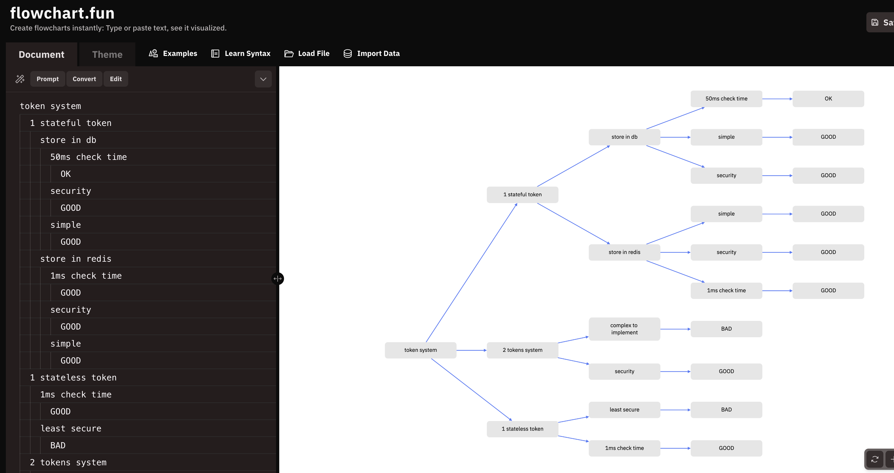

# Auth

**Projects:** `apps/api`, `apps/web`

**Decision:** Use a single stateful token stored in the database. Later, consider moving to a cache (e.g. Redis) for faster lookups.

## Login flow (Google OAuth)

1. User clicks "Sign in with Google" → browser navigates to `/api/auth/google-login`
2. Passport redirects to Google consent screen
3. Google redirects to `/api/auth/google-login/callback`
4. `GoogleStrategy.validate()` looks up user by email — rejects if no account exists
5. `SessionService.createSession()` generates a random token, stores SHA-256 hash in `user_sessions`
6. `setSessionCookie()` sets `session_token` as an httpOnly cookie
7. Backend redirects to `FRONTEND_URL`
8. `App.tsx` calls `GET /auth/me` → SessionGuard validates cookie → user is logged in

## Session validation

- Every request (except `@Public()` routes) passes through `SessionGuard`
- Guard extracts `session_token` cookie, hashes it, queries `user_sessions` joined with `users`
- Checks expiry and revocation, attaches `AuthUser` ({ id, email }) to `request.user`

## Logout

- `POST /auth/logout` revokes session in DB + clears cookie
- Frontend calls logout, clears localStorage, resets React Query → shows login screen

## 401 handling

- `main.tsx` has openapi-fetch middleware: any 401 (except `/auth/me` itself) invalidates the `/auth/me` query
- This triggers re-render in `App.tsx` which shows the login screen

## Key files

| File                                          | Role                                                            |
| --------------------------------------------- | --------------------------------------------------------------- |
| `apps/api/src/auth/auth.controller.ts`        | Routes: `me`, `logout`, `google-login`, `google-login/callback` |
| `apps/api/src/auth/session.service.ts`        | Session CRUD: create, validate, revoke, findUserByEmail         |
| `apps/api/src/auth/session.guard.ts`          | Global guard — validates session cookie on every request        |
| `apps/api/src/auth/google.strategy.ts`        | Passport Google OAuth strategy — rejects unknown emails         |
| `apps/api/src/auth/cookie.helper.ts`          | `setSessionCookie` / `clearSessionCookie` helpers               |
| `apps/api/src/auth/public.decorator.ts`       | `@Public()` decorator to bypass SessionGuard                    |
| `apps/api/src/auth/current-user.decorator.ts` | `@CurrentUser()` param decorator + `AuthUser` type              |
| `apps/web/src/App.tsx`                        | Auth gate — renders Login or app based on `/auth/me`            |
| `apps/web/src/main.tsx`                       | Global 401 middleware                                           |
| `apps/web/src/pages/login/Login.tsx`          | Google sign-in button                                           |
| `packages/database/src/schema.ts`             | `user_sessions` table (token hash, expiry, revocation)          |
